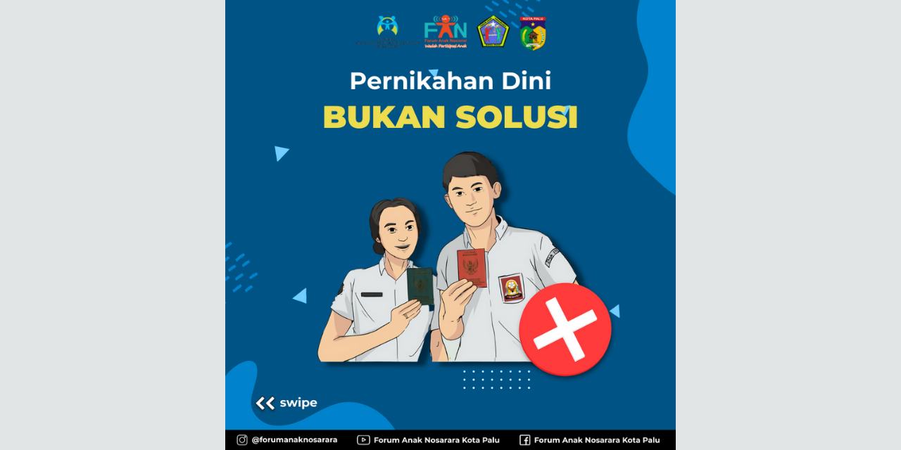

# Social Media Content Creating for Non-profit Organization (Group Social Project)
This is a final project of the Statespersonship course that we worked on in a group team consist of 10 members. In this project, we provide our assistance to create content voluntarily for a non-profit organization based in Palu City, Central Sulawesi. The organization we invite to work with is the Palu City Children's Forum (@forumanaknosarara) which is under the auspices of the Palu City Women's Empowerment and Child Protection Service (DP3A). In order to create the content, we used Figma to help us to do the content design that we will give later to the forum.

We help them for a month with one Instagram feed and story design in a week, so there are 4 different Instagram feed and story design themes that we create for them such as child sexual abuse, child abuse, early child marriage, and child drug abuse. We also help them to create their forum 8th birthday twibbon design for their Instagram story.

For more detail about what exactly the social project we are doing, you may download and read our presentation slides that I have already attached within this repository. 

